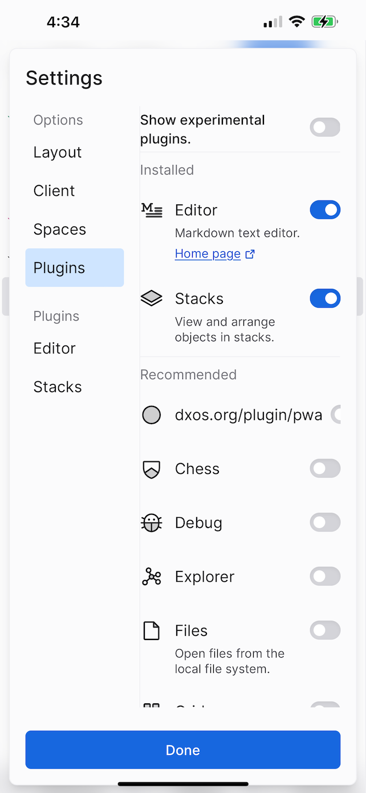

# dxos ssc QA

We can move these into individual issues once they are validated.

- [iOS build docs](https://github.com/bcomnes/dxos/tree/bcomnes/ios-build/packages/apps/composer-app/docs/ios)

## Video comments

<video src="./img/walkthrough.mp4" width="300"></video>

The header has a positioning bug when the text editor is open.

- UI Is pushed up over the notch safe area
- Buttons are not responsive to touch

<video src="./img/toolbar-bug.mp4" width="300"></video>

When the editor isn't pushing into the safe zone, the header is highly compressed.

The onboarding shortcuts menu is also overflowing.

Using the inspector you can see the misalignment between the DOM and the rendering. Consulting with jwerle to see if this is a platform bug or not.

Comparing to the PWA verison, you can see the safe area is padded out. Also note the editor buttons (and their omission) from the socket build. Not sure whats happening there yet.

Left pannel looks good.

Profile pane looks good

Settings pane is very squished

UI text is selectible in undesirable ways possibly

## Networking

I was able to link devices and the networking worked (tested over LAN).

The link to connected was broken but the invite codes worked across app hosts.

<video src="./img/networking.mp4" width="300"></video>

